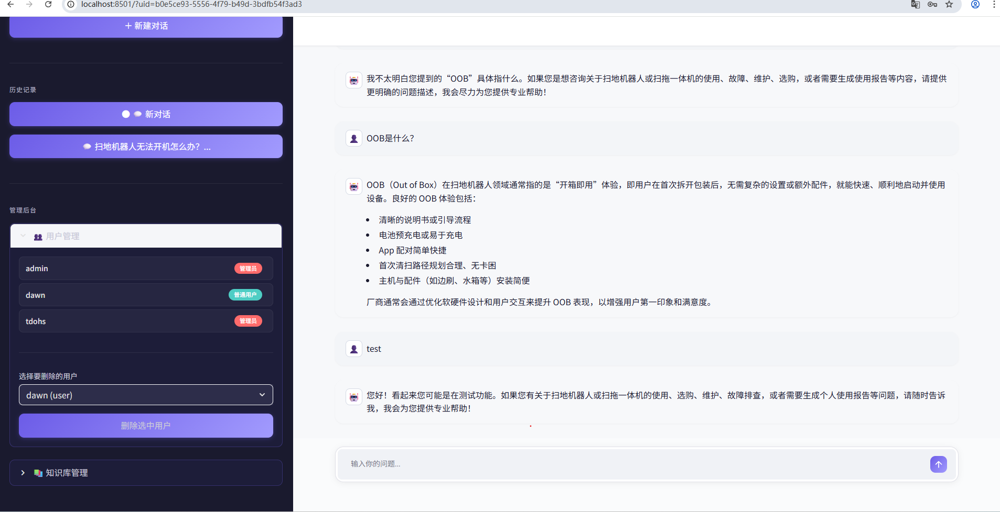
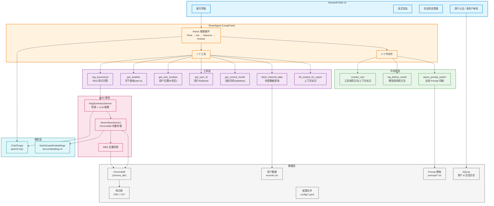
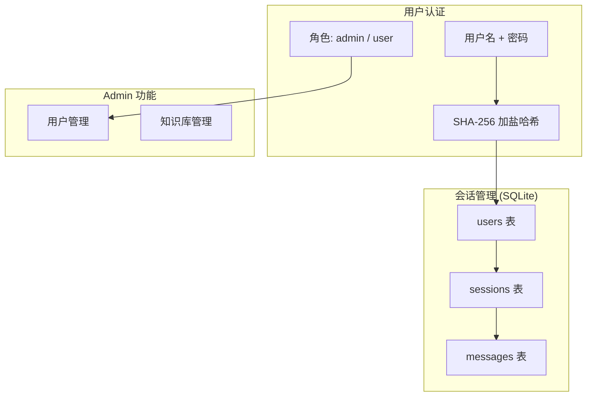
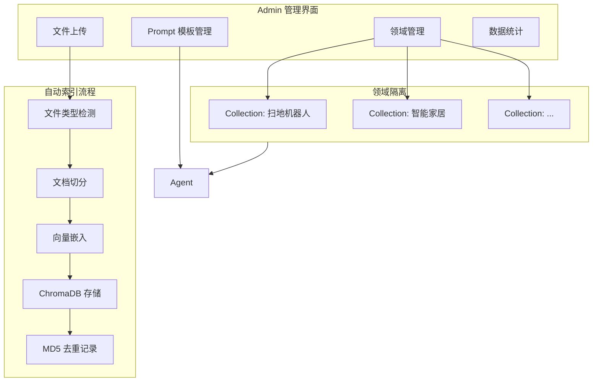
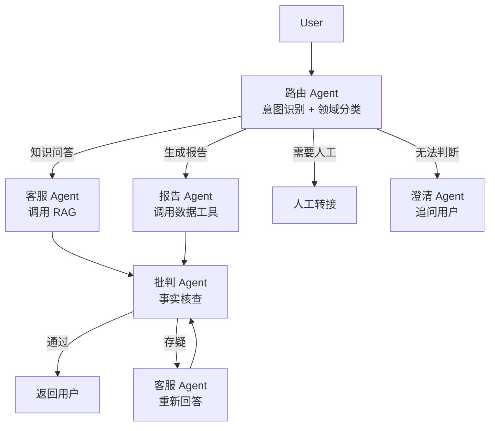
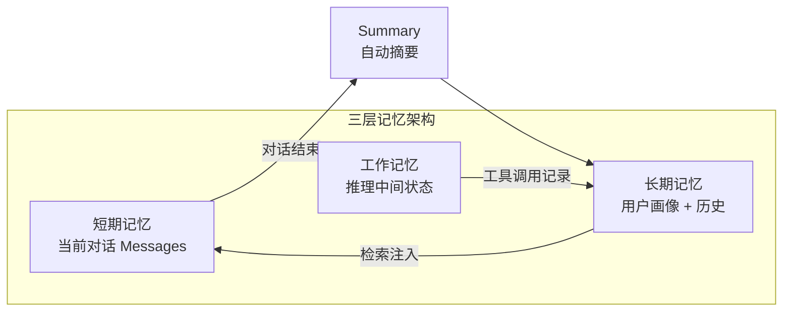
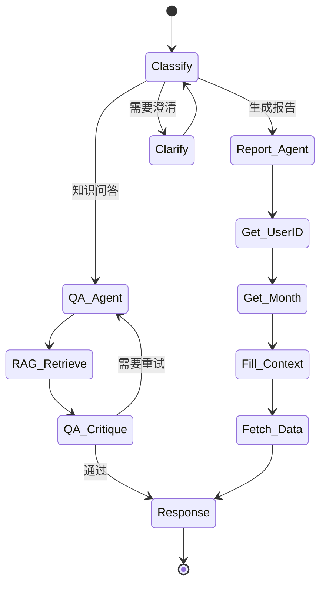

# 智能客服 - AI Agent

基于 LangChain + ReAct Agent + RAG 的智能客服系统，专为**扫地机器人/扫拖一体机器人**产品提供智能问答、故障排查、选购指南及个人使用报告生成等服务。

## 项目简介

本项目是一个中文智能客服 Chatbot，采用 **ReAct（推理+行动）Agent** 架构，结合 **RAG（检索增强生成）** 技术，通过流式输出为用户提供即时的智能对话体验。系统支持知识库问答、工具调用、动态 Prompt 切换、用户数据报告生成等能力。

## UI 界面


## 技术架构



## 核心组件

| 组件 | 路径 | 说明 |
|------|------|------|
| 入口 & UI | `main.py` | Streamlit 聊天界面，用户认证，管理后台，流式渲染 |
| ReAct Agent | `agent/react_agent.py` | LangChain Agent，绑定工具与中间件，流式输出 |
| 工具集 | `agent/tool/agent_tools.py` | 7 个工具（RAG/天气/位置/用户ID/月份/外部数据/上下文标记） |
| 中间件 | `agent/tool/middleware.py` | 工具调用日志 / 模型调用前日志 / 动态 Prompt 切换 |
| 模型工厂 | `model/factory.py` | ChatTongyi (qwen3-max) / DashScopeEmbeddings (text-embedding-v4) |
| RAG 服务 | `rag/rag_service.py` | 检索 + 摘要生成，相似度过滤与去重 |
| 向量存储 | `rag/vector_store.py` | ChromaDB 管理，支持 PDF/TXT 加载与 MD5 去重 |
| 会话管理 | `utils/chat_history_manager.py` | SQLite 持久化，多用户隔离，密码哈希，角色管理 |
| 配置中心 | `config/*.yaml` | rag / chroma / agent / prompts 配置 |
| 提示词 | `prompts/*.txt` | 主提示词 / RAG 摘要 / 报告生成 |
| 知识库 | `data/*.pdf`, `data/*.txt` | 产品 FAQ、故障排除、维护保养、选购指南 |
| 工具函数 | `utils/` | 配置加载、路径解析、文件处理、日志、Prompt 加载 |

## 工具说明

| 工具名 | 功能 | 状态 |
|--------|------|------|
| `rag_summarize` | 基于向量检索回答用户知识类问题 | ✅ 已实现 |
| `get_weather` | 接入 wttr.in API 获取实时天气 | ✅ 已替换 |
| `get_user_location` | 接入 ip-api.com IP 定位获取用户城市 | ✅ 已替换 |
| `get_user_id` | 获取用户 ID（当前 Mock，待接入认证系统） | ⏳ Mock |
| `get_current_month` | 使用 `datetime.now()` 获取当前月份 | ✅ 已修复 |
| `fetch_external_data` | 查询用户扫地机器人使用记录（CSV） | ⏳ 待接入数据库 |
| `fill_context_for_report` | 触发中间件切换到报告生成模式 | ✅ 已实现 |

## 中间件

| 中间件 | 功能 |
|--------|------|
| `monitor_tool` | 记录每次工具调用（名称、参数、输出），支持上下文标记 |
| `log_before_model` | 模型调用前打印消息数量和最后一条消息内容 |
| `report_prompt_switch` | 当上下文标记为报告模式时，切换为 `report_prompt.txt` |

## 快速开始

### 环境要求

- Python 3.9+
- DashScope API Key（阿里云通义千问）

### 安装

```bash
# 创建虚拟环境
python -m venv ai-agent-venv
source ai-agent-venv/bin/activate

# 安装依赖
pip install -r requirement.txt
```

### 配置

在环境中设置 DashScope API Key：

```bash
export DASHSCOPE_API_KEY="your-api-key-here"
```

### 运行

```bash
streamlit run main.py
```

浏览器访问 `http://localhost:8501` 即可开始对话。

### 用户体系

- **注册**：在左侧边栏选择"注册"，设置用户名和密码
- **角色**：注册时可选择"普通用户"或"管理员"
  - 普通用户：聊天功能
  - 管理员：聊天 + 用户管理 + 知识库管理
- **管理员验证码**：`admin888`（注册管理员时需要）
- **登录持久化**：登录状态通过 URL 参数保持，刷新页面无需重新登录

### 示例对话

**知识问答：**
```
用户: 扫地机器人不出水怎么办？
AI: [通过 RAG 检索知识库后回答...]
```

**使用报告：**
```
用户: 帮我生成我的使用报告
AI: [自动获取用户ID、月份，查询使用记录并生成报告]
```

## 目录结构

```
ai-agent/
├── main.py                      # Streamlit 入口，用户认证，管理后台
├── requirement.txt              # Python 依赖
├── config/                      # YAML 配置
│   ├── agent.yaml
│   ├── chroma.yaml
│   ├── prompts.yaml
│   └── rag.yaml
├── prompts/                     # Prompt 模板
│   ├── main_prompt.txt
│   ├── rag_summarize.txt
│   └── report_prompt.txt
├── agent/                       # Agent 核心逻辑
│   ├── react_agent.py           # ReAct Agent，流式输出
│   └── tool/
│       ├── agent_tools.py       # 7 个工具实现
│       └── middleware.py        # 3 个中间件
├── model/                       # 模型工厂
│   └── factory.py
├── rag/                         # RAG 服务
│   ├── rag_service.py           # 检索 + 摘要，相似度过滤
│   └── vector_store.py          # ChromaDB 管理
├── utils/                       # 工具函数
│   ├── chat_history_manager.py  # SQLite 会话管理，多用户，密码哈希
│   ├── config_handler.py
│   ├── file_handler.py
│   ├── logger_handler.py
│   ├── path_tool.py
│   └── prompt_loader.py
├── data/                        # 知识库 & 外部数据
│   ├── external/records.csv
│   ├── 扫地机器人100问2.txt
│   ├── 扫拖一体机器人100问.txt
│   ├── 故障排除.txt
│   ├── 维护保养.txt
│   ├── 选购指南.txt
│   └── chat_history.db          # SQLite 数据库（自动生成）
├── logs/                        # 运行日志
├── chroma_db/                   # 向量数据库持久化
└── ai-agent-venv/               # 虚拟环境
```

## 优化路线图

> 参考 OpenAI Assistants API、LangGraph、AutoGen、CrewAI、MetaGPT、ChatDev、Dify 等成熟 Agent 框架的最佳实践，以下为项目的完整演进方向。

### Phase 1 - 基础完善（短期）

#### 1.1 Mock 工具替换为真实服务 ✅

当前 4 个工具均为 Mock，需替换为真实功能：

| 工具 | 原状态 | 当前状态 | 实现方式 |
|------|--------|---------|---------|
| `get_weather` | 硬编码字符串 | ✅ 已替换 | 接入 wttr.in 免费天气 API，通过城市名获取实时天气 |
| `get_user_location` | `random.choice` | ✅ 已替换 | 接入 ip-api.com IP 定位 API，基于用户 IP 返回城市 |
| `get_user_id` | `random.choice` | ⏳ Mock | 待接入 OAuth2/JWT 认证，从 token 中提取 user_id |
| `get_current_month` | `random.choice` | ✅ 已修复 | `datetime.now().strftime("%Y-%m")`，返回真实当前月份 |
| `fetch_external_data` | CSV 静态文件 | ⏳ 待优化 | 待接入 PostgreSQL/MySQL，通过 SQLAlchemy ORM 查询 |

#### 1.2 流式输出 ✅

- ~~`main.py` 中 `response_messages[-1]` 仅取最后一个 chunk，应改为 `"".join(response_messages)` 拼接完整回复~~
- ~~移除 `time.sleep(0.01)` 模拟打字效果，保留真实流式渲染体验~~
- ✅ 参考 LangGraph 的 `stream_mode="messages"` 实现流式输出
- ✅ 过滤中间工具调用阶段的消息（`tool_calls` / `tool_call_chunks`）
- ✅ 只 yield 最终回答的文本内容给前端
- ✅ Streamlit `st.write_stream` 实时渲染

#### 1.3 会话历史持久化 ✅

- ~~当前 `st.session_state["message"]` 仅存于内存，刷新即丢失~~
- ✅ 使用 SQLite 存储用户、会话、消息（`utils/chat_history_manager.py`）
- ✅ 实现 `get_history(session_id)` 接口
- ✅ 会话自动持久化，刷新页面不丢失
- ✅ 支持会话切换、新建、删除
- ✅ 登录状态通过 `st.query_params` 保持，刷新无需重新登录
- ✅ 参考 LangGraph 的 `MemorySaver` / `SqliteSaver` 实现检查点机制

#### 1.4 向量检索调优 ✅

- ~~`chunk_size: 200` 过小，语义易割裂，建议调至 **500-800**~~
- ~~`k: 3` 返回片段太少，建议调至 **5-8**~~
- ✅ 添加 `similarity_score_threshold = 0.6` 过滤低质量检索结果
- ✅ 基于内容前 100 字符去重
- ✅ 返回 Top 5 结果
- ✅ 检索结果为空时返回空字符串，Agent 基于自身知识回答
- ⏳ 引入 **HyDE（假设文档嵌入）**：先让 LLM 生成假设性答案，用假设答案做向量检索，显著提升召回率
- ⏳ 引入 **Multi-Query Retriever**：自动生成多个检索角度的 query，合并去重后检索
- ⏳ 引入 **Reranker**（如 Cohere/BGE-Reranker）：对检索结果二次排序，提升精确率

#### 1.5 Agent 输出质量 ✅

- ✅ 检索结果为空时不返回"未找到"等提示，避免 Agent 原样转述给用户
- ✅ 规范化参考资料格式，避免元数据泄露
- ⏳ 增加 **输出长度控制**：避免过长或过短的回答
- ⏳ 增加 **语言风格一致性**：确保回答始终为中文，语气专业友好

### Phase 2 - 多用户与领域扩展（中期）

#### 2.1 多用户体系 ✅

- ✅ 用户注册 / 登录，密码 SHA-256 加盐哈希存储
- ✅ 用户角色：`admin`（管理员）/ `user`（普通用户）
- ✅ 每个用户拥有独立的对话历史（session isolation）
- ✅ 管理员可管理用户（修改角色、删除用户）
- ✅ 登录状态持久化（`st.query_params`）
- ⏳ 接入 OAuth2 / JWT 认证
- ⏳ 偏好设置（语言风格、回答长度等）
- ⏳ 个人设备数据绑定（扫地机器人 SN 码关联）
- ⏳ 参考 OpenAI Assistants API 的 `thread` 概念：每个用户拥有独立的对话线程



#### 2.2 Admin 知识库管理后台 ✅ 基础版

参考 Dify 的知识库管理模块：

- ✅ Admin 登录后显示管理后台
- ✅ 用户管理：查看用户列表、修改角色、删除用户
- ✅ 知识库管理：查看已有文件、上传 PDF/TXT/MD 文件
- ⏳ 知识库版本管理（更新/回滚/对比）
- ⏳ 查看知识库加载状态与 MD5 去重记录
- ⏳ 按领域隔离向量集合（ChromaDB collection 按领域划分）
- ⏳ 支持知识条目的增删改查（CRUD），而非仅限文件级操作
- ⏳ 实现通用聊天机器人能力：
  - Admin 创建新领域（如 "智能家居"、"家电维修"、"汽车保养"）
  - 上传该领域资料后自动索引
  - 用户可按领域切换对话场景，或 Agent 自动识别领域路由
  - 支持 **Prompt 模板管理**：每个领域可配置独立的系统提示词



#### 2.3 知识库实时更新

- 监听 `data/` 目录变更（`watchdog`），新文件自动入库
- 支持通过 API 动态添加/删除文档，无需重启服务
- MD5 去重从文件迁移至 Redis，支持分布式部署
- 参考 MetaGPT 的知识管理：支持文档的增量更新，而非全量重建

### Phase 3 - Agent 能力增强（中长期）

#### 3.1 多 Agent 协作

参考 CrewAI / AutoGen 模式，实现分工明确的多 Agent 架构：

| Agent | 职责 | 工具 | 参考框架 |
|-------|------|------|---------|
| **路由 Agent** | 意图识别与任务分发 | 无（纯推理） | LangGraph 的 `router` 节点 |
| **客服 Agent** | 日常知识问答 | `rag_summarize` | CrewAI 的 `Agent(role="客服")` |
| **报告 Agent** | 生成设备使用报告 | `fetch_external_data`, `fill_context_for_report` | AutoGen 的 `AssistantAgent` |
| **批判 Agent** | 事实核查、幻觉检测 | `rag_summarize`（用于交叉验证） | MetaGPT 的 `QA` 角色 |
| **人工转接 Agent** | 识别需人工介入的场景 | 无 | OpenAI Assistants 的 `handoff` |



#### 3.2 记忆系统升级

参考 LangGraph 的记忆模式：

- **短期记忆**：当前对话上下文（已实现）
- **长期记忆**：用户偏好、历史问题、设备信息等持久化存储
- **工作记忆**：Agent 推理过程中的中间状态，支持多步任务跟踪
- 实现 **Summary Memory**：对话过长时自动摘要，避免超出上下文窗口
- 实现 **Entity Memory**：提取对话中的实体（用户、设备、问题类型），建立关联图谱
- 参考 LangGraph 的 `MemoryStore`：支持跨会话的长期记忆检索



#### 3.3 工具执行增强

- 添加 **工具权限控制**：不同用户可调用不同工具（Admin 可调用管理工具，普通用户不可）
- 实现 **工具执行超时与重试**：设置单次调用超时（如 10s），失败自动重试 2 次
- 添加 **工具输出缓存**：相同参数调用直接返回缓存结果（TTL 5 分钟），减少外部 API 调用
- 支持 **并行工具调用**：多个独立工具同时执行（如同时查天气和查设备状态）
- 参考 OpenAI Assistants 的 **Tool Choice** 策略：支持 `auto` / `required` / `none` 三种模式
- 实现 **工具注册中心**：支持运行时动态注册/注销工具，无需重启服务

#### 3.4 Human-in-the-Loop

- Agent 遇到不确定问题时，主动询问用户确认
- 关键操作（如修改设备设置、提交工单）需用户二次确认
- 支持用户纠正 Agent 的回答，反馈数据用于后续优化
- 参考 LangGraph 的 `interrupt_before` / `interrupt_after`：在特定节点暂停，等待人工输入
- 实现 **审批工作流**：敏感操作需 Admin 审批后才能执行

#### 3.5 结构化输出

- 参考 OpenAI Assistants 的 **Structured Output**：
  - 报告生成使用 JSON Schema 约束输出格式
  - 工具调用结果使用 Pydantic Model 校验
  - 最终回答支持 Markdown 格式化（含标题、列表、表格等）
- 实现 **输出解析器**：将 LLM 输出解析为结构化数据，便于前端渲染

### Phase 4 - 生产级特性（长期）

#### 4.1 可观测性与评估

- 集成 **LangSmith / LangFuse** 实现：
  - 完整的 Trace 追踪（用户输入 → Agent 推理 → 工具调用 → 输出）
  - Token 用量统计与成本分析
  - Latency 监控与性能瓶颈定位
  - 工具调用成功率与错误分类
- 引入 **RAGAS** 框架评估：
  - Context Precision（检索相关性）
  - Faithfulness（回答忠实度）
  - Answer Relevance（回答相关性）
- 实现 **A/B 测试框架**：对比不同 Prompt / 模型 / 检索策略的效果

#### 4.2 多模型支持

- 当前绑定 `qwen3-max`，应支持模型热切换：
  - 按场景选择模型（简单问答用轻量模型，复杂任务用大模型）
  - 支持 OpenAI / Claude / DeepSeek / 本地模型等多厂商
  - 实现模型降级策略（主模型不可用时自动切换备用模型）
  - 参考 LiteLLM 的统一接口：一套代码适配多厂商 API
- 实现 **模型路由**：根据任务复杂度自动选择模型

#### 4.3 安全与合规

- 输入过滤：防止 Prompt Injection / Jailbreak 攻击
- 输出审核：敏感内容过滤、事实性校验
- 数据脱敏：用户隐私信息（手机号、地址）在日志中自动脱敏
- API Key 安全：从硬编码迁移至环境变量/Vault，支持密钥轮换
- 实现 **Rate Limiting**：限制用户调用频率，防止滥用
- 符合 GDPR / 个人信息保护法 要求

#### 4.4 部署与运维

- Docker Compose 一键部署（含 Redis、PostgreSQL、ChromaDB、App）
- Kubernetes 部署支持（HPA 自动扩缩容）
- CI/CD 流水线：代码检查 → 测试 → 构建 → 部署
- 健康检查端点与 graceful shutdown
- 实现 **蓝绿部署 / 金丝雀发布**：零停机更新

### Phase 5 - 架构升级（远期）

#### 5.1 Graph-based Agent

参考 LangGraph 的图状态机架构：

- 将当前的线性 ReAct 循环升级为 **有向图**
- 每个节点是一个处理单元（推理/工具调用/人工审核）
- 支持条件分支、并行执行、循环重试
- 实现 **可视化执行路径**：用户可看到 Agent 的决策过程



#### 5.2 插件化工具系统

- 参考 ChatGPT Plugins / OpenAI Function Calling：
  - 工具定义使用标准 JSON Schema
  - 支持第三方开发者编写自定义工具插件
  - 工具热加载/卸载，无需重启
- 实现 **工具市场**：Admin 可从工具市场选择并启用新工具

#### 5.3 多模态支持

- 支持图片输入（用户上传设备故障照片，Agent 识别问题）
- 支持语音输入/输出（语音交互模式）
- 支持文档解析（用户上传设备说明书，自动索引）
- 参考 GPT-4V / Qwen-VL 的多模态能力

### 优化优先级总览

| 阶段 | 任务 | 时间 | 状态 |
|------|------|------|------|
| **Phase 1 - 基础完善** | Mock 工具替换 | 2026-05 | ✅ Done（天气/位置/月份） |
| | 流式输出修复 | 2026-05 | ✅ Done |
| | 会话历史持久化 | 2026-05 | ✅ Done |
| | 向量检索调优 | 2026-05 | ✅ Done |
| | Agent 输出质量 | 2026-05 | ✅ Done |
| **Phase 2 - 多用户与领域** | 多用户体系 | 2026-05 | ✅ Done |
| | Admin 知识库管理 | 2026-05 | ✅ Done(基础版) |
| | 知识库实时更新 | 待定 | ⏳ 待开始 |
| **Phase 3 - Agent 增强** | 多 Agent 协作 | 2026-08 ~ 09 | ⏳ 待开始 |
| | 记忆系统升级 | 待定 | ⏳ 待开始 |
| | 工具执行增强 | 待定 | ⏳ 待开始 |
| | Human-in-the-Loop | 待定 | ⏳ 待开始 |
| | 结构化输出 | 待定 | ⏳ 待开始 |
| **Phase 4 - 生产级** | 可观测性与评估 | 2026-10 ~ 11 | ⏳ 待开始 |
| | 多模型支持 | 待定 | ⏳ 待开始 |
| | 安全与合规 | 待定 | ⏳ 待开始 |
| | 部署与运维 | 待定 | ⏳ 待开始 |
| **Phase 5 - 架构升级** | Graph-based Agent | 2027-01 ~ 02 | ⏳ 待开始 |
| | 插件化工具系统 | 待定 | ⏳ 待开始 |
| | 多模态支持 | 待定 | ⏳ 待开始 |

## License

MIT


## Endding

一起交流学习，求star
